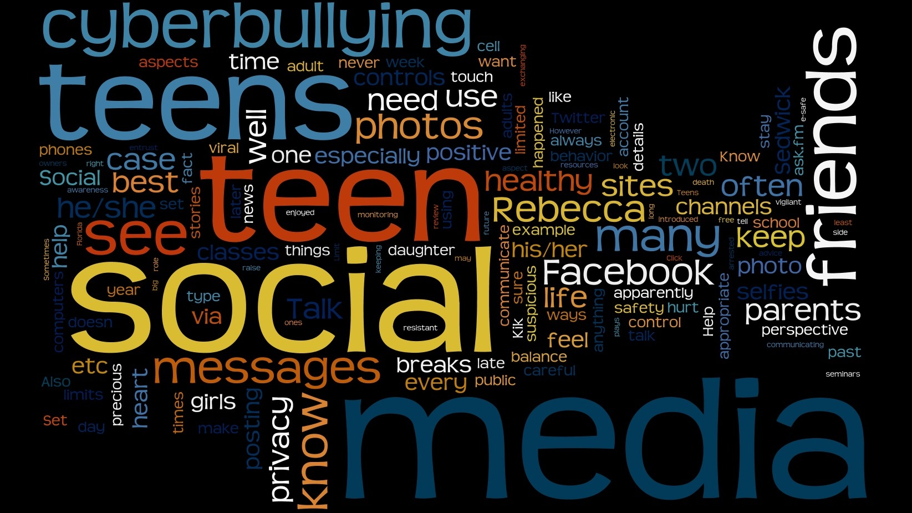
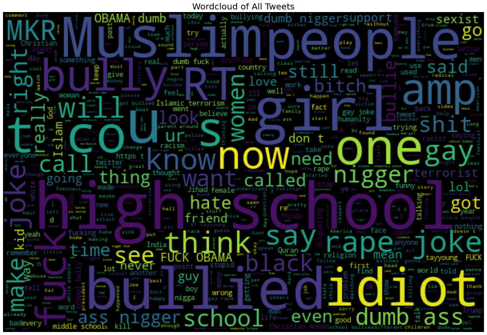

# Twitter_Cyberbulling Hate Speech Analysis

 - Education Purposes
 - Used Natural Language Processing 
 - Lemmatization is the process of grouping together the different inflected forms of a word so they can be analyzed as a single item. Lemmatization is similar to stemming but it brings context to the words. So it links words with similar meanings to one word.
 - from nltk.stem import WordNetLemmatizer
 - lematizer=WordNetLemmatizer()
 - Doing Morphological Analysis.
 - Actually, lemmatization is preferred over Stemming because lemmatization does morphological analysis of the words.
# After Test

